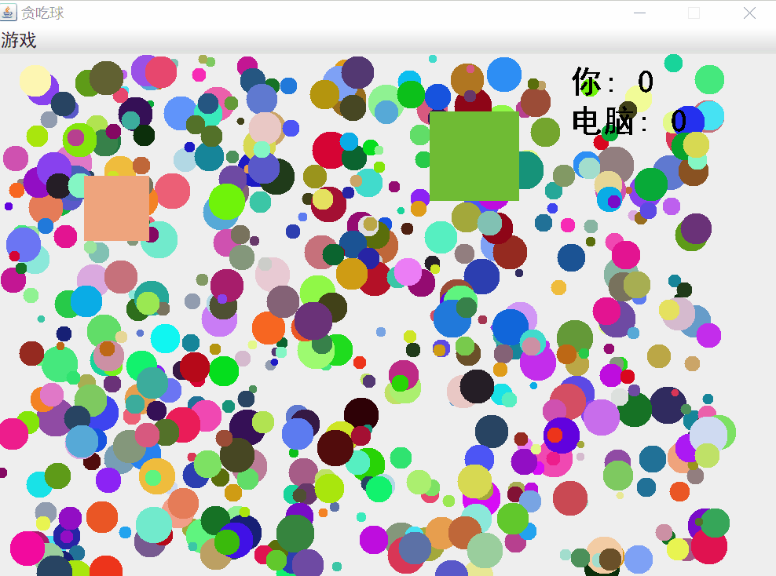
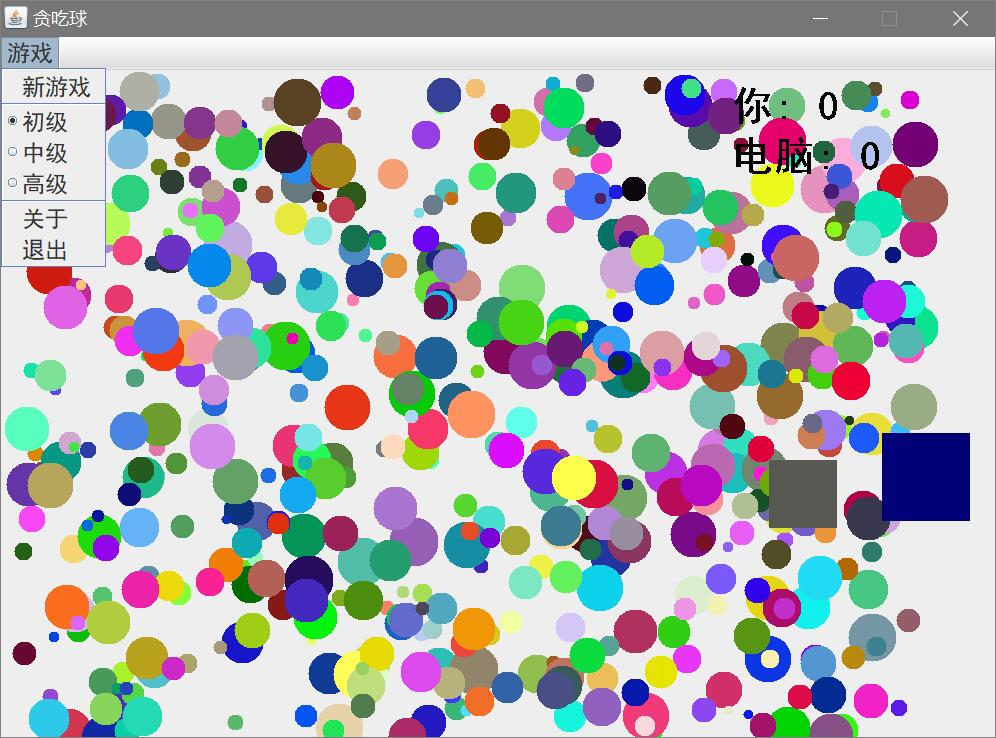
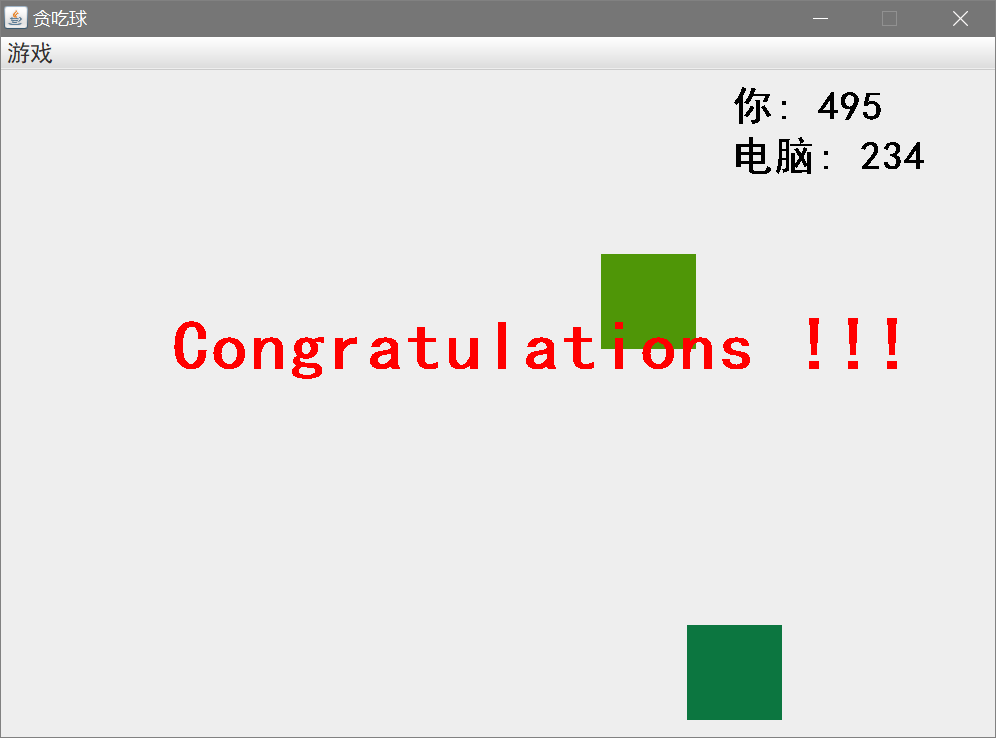
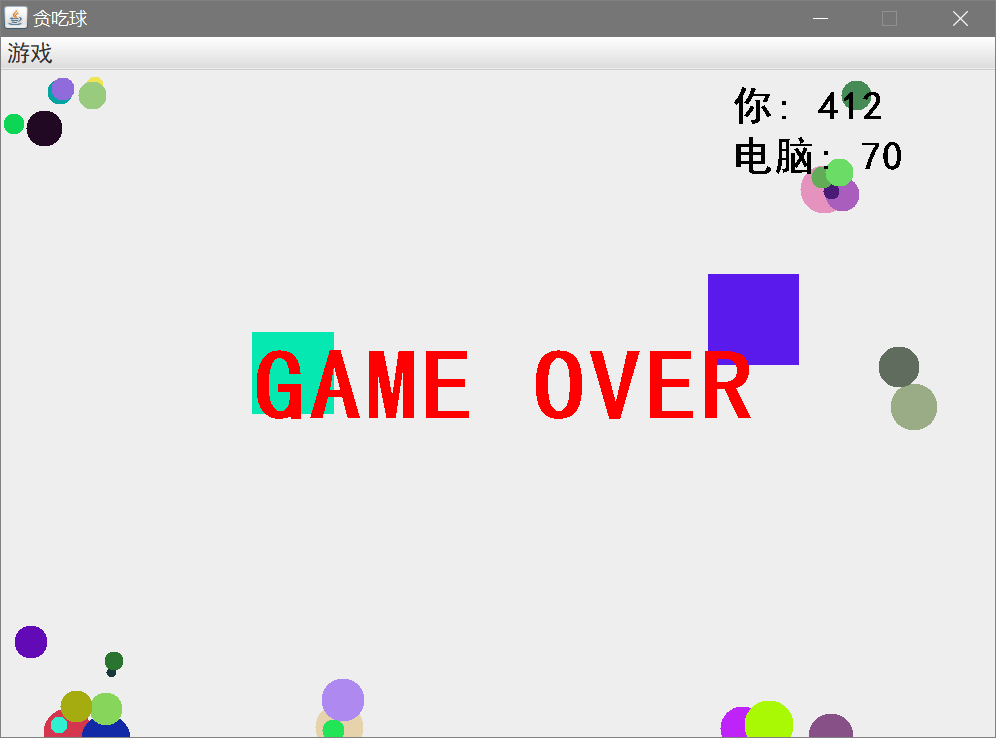

# GreedyBall 🔮贪吃球游戏

## 简介

这是自己设计的一款类似于`大鱼吃小鱼`的游戏。

玩家控制的是一个黑色的小球；数量庞大且五颜六色静止的小球为食物；若干随机运动的正方形表示电脑控制的角色。

玩家可以控制一个自己的小球将比自己小的小球或正方形吃掉来获取得分和增加直径。吃掉小球后也有一定几率会减少直径和扣分。

游戏有三种难度，运动正方形的数目随着难度增加而增加。食物小球数目减少到一定程度时会得到补充。

## 胜利条件

符合下面其中一种条件即为玩家胜利：

1. 在所有静止小球被吃完后，得分比电脑得分高
2. 将电脑控制的正方形都吃掉

符合下面其中一种条件即为玩家失败：

1. 在所有静止小球被吃完后，得分比电脑得分低
2. 被比玩家小球更大的正方形碰到或吃掉

## 操作

鼠标单击任意位置放置黑球开始游戏，鼠标控制黑球移动。

## 截图

### 游戏演示

### 游戏界面

### 游戏胜利

### 游戏失败

## 更新日志

### V 1.0 (2018-10-24)

+ 修改游戏参数，使其更具有可玩性
+ 添加菜单栏，增加三种难度选项
+ 增加国际化功能，可根据系统环境自动选择对应语言，目前支持中文和英文	
+ 添加注释

## TODO

- [ ] 进一步完善游戏规则，提高可玩性
- [ ] 将所有游戏参数提取都放到一个类里
